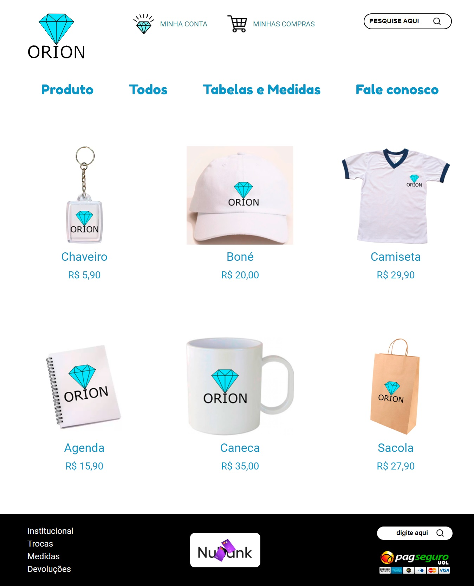
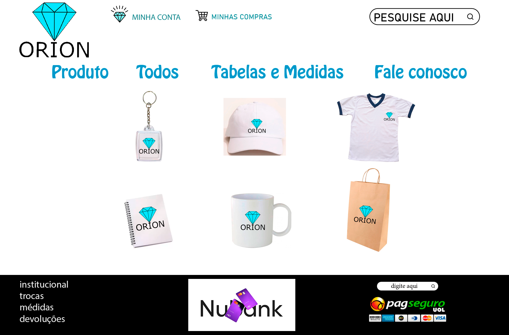

# 💎 Orion 💎
 
<h3 align="justify">Projeto feito como exercício de prática baseado na atividade da ETEC Comendador João Rays - 1ºMTECPI - Arte Digital. A atividade consistia em criar a interface de um site no Photoshop e pelo próprio software converter em HTML.</h3>

 

(Porém para praticar, eu reuni alguns protótipos criados pelos meus colegas de classe, e passei para HTML através dos códigos.)

 
 

  

## Tópicos

- [Imagem do projeto](#img)
- [Acesso ao projeto](#acesso)
- [Descrição do projeto](#desc)
- [Tecnologias utilizadas](#tec)
- [Status do projeto](#status)
- [Protótipo feito no Photoshop](#proto)
- [Desenvolvedora do protótipo](#dev-proto)
- [Desenvolvedor do site](#dev-site)
- [Licença](#license)

 

<h2 id="img">📺 Imagem do projeto</h2>

    

 

<h2 id="acesso">🔗 Acesso ao projeto</h2>

Acesse o projeto clicando [aqui](https://fel1324.github.io/Orion/).

 

<h2 id="desc">📘 Descrição do projeto</h2>

A Orion consiste em um modelo de E-commerce que se estivesse atuando no mercado, seria responsável por vender produtos como: agendas, canecas, chaveiros, camisetas etc. Todos os itens da Orion têm como decoração a logo do site.

 

<h2 id="tec">💠 Tecnologias utilizadas</h2>

* HTML
* CSS
* Git e Github

 

<h2 id="status">🚧 Status do projeto</h2>

✔️ Projeto Finalizado

 

<h2 id="proto">🖼️ Protótipo feito no Photoshop</h2>

    

<h2 id="dev-proto">👷‍♀️ Desenvolvedora do protótipo</h2>

O protótipo foi desenvolvido pela minha colega de classe: 

* Priscila Natalia Prevelato Antognolli

 

<h2 id="dev-site">👨‍💻 Desenvolvedor do site</h2>

* Rafael Roberto de Oliveira

 

<h2 id="license">📝 Licença</h2>

Esse projeto está sob a licença MIT.